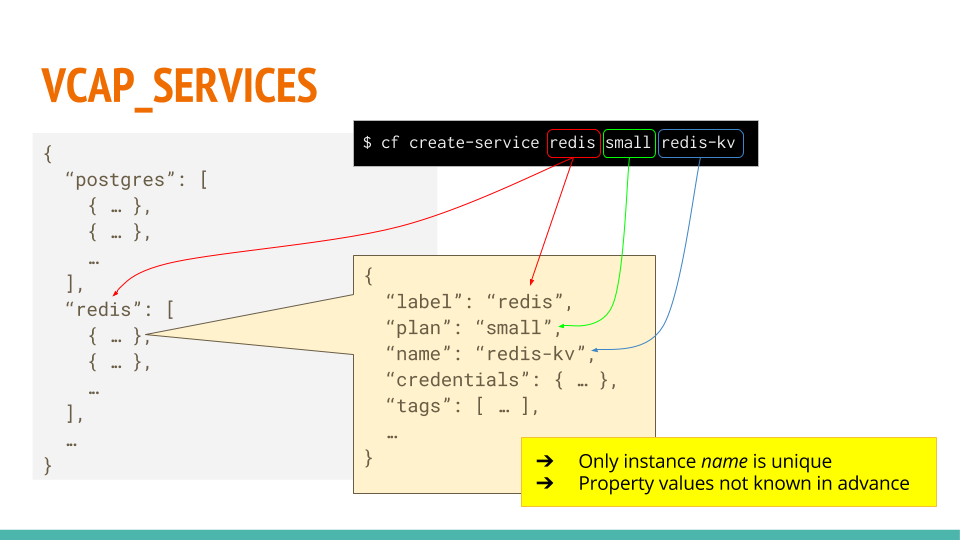

# cf-services
Simple node package to lookup bound services in [Cloud Foundry]

## Background
Cloud Foundry provides the credentials of bound [service instances][2] via
[VCAP_SERVICES] environment variable.



Notice that *VCAP_SERVICES* object uses service names as keys.
Since multiple instances of the same service can be bound to one application,
the property values are arrays of service bindings.
This makes it uncomfortable for applications to lookup required
service bindings in a reliable way.

## Install

```sh
npm install --save cf-services
```

## Usage
```js
const cfServices = require('cf-services');
```
Parse *VCAP_SERVICES* and convert it to a flat object of service bindings using
instance names as keys.

### Local execution

## API


[Cloud Foundry]:https://www.cloudfoundry.org/
[2]:https://docs.cloudfoundry.org/devguide/services/
[VCAP_SERVICES]:https://docs.cloudfoundry.org/devguide/deploy-apps/environment-variable.html#VCAP-SERVICES
